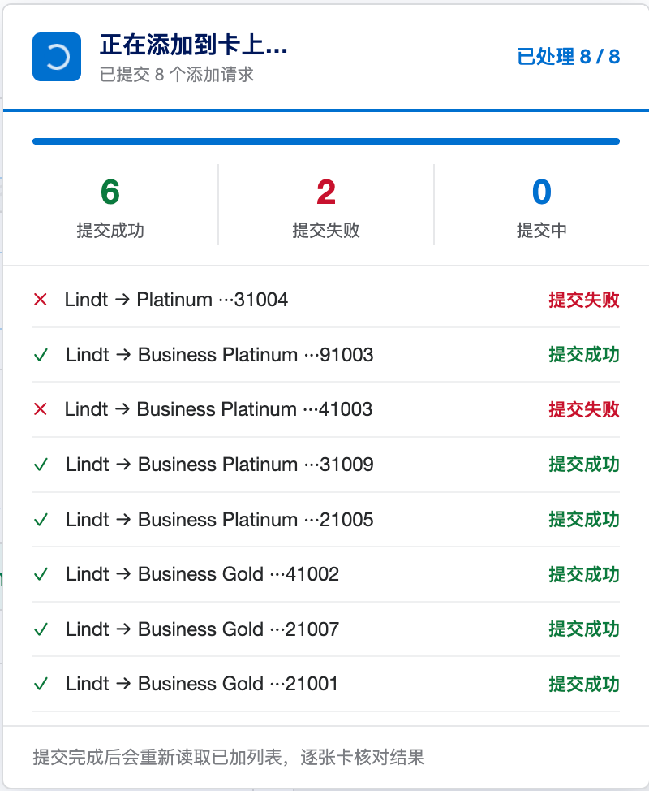
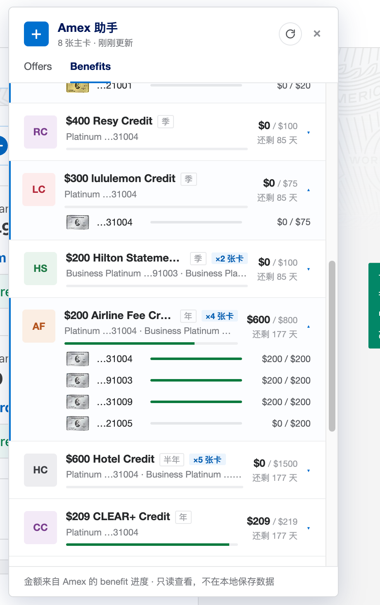

<div align="center">

# Amex Assistant

**批量管理 Amex Offers，并集中查看多卡 Benefits 进度。**<br>
**Manage Amex Offers across cards and review Benefits progress in one panel.**

<br>

[](https://greasyfork.org/en/scripts/585884-amex-assistant)
[](https://greasyfork.org/en/scripts/585884-amex-assistant)
[](https://github.com/olddonkey/amex-assistant/stargazers)
[](LICENSE)
[](#privacy)
[](src/amex-assistant.user.js)

[](https://greasyfork.org/en/scripts/585884-amex-assistant)

<br>

<table>
<tr valign="top">
<td align="center" width="33%"><br><sub><b>Offers 列表</b><br>跨卡搜索、筛选并选择要添加的 offer。</sub></td>
<td align="center" width="33%"><br><sub><b>提交进度</b><br>同一 offer 的多张卡会一起提交。</sub></td>
<td align="center" width="33%"><br><sub><b>结果核对</b><br>重新读取 added list 后展示最终结果。</sub></td>
</tr>
</table>

<table>
<tr valign="top">
<td align="center" width="50%"><br><sub><b>Benefits 总览</b><br>按到期时间查看 statement credits。</sub></td>
<td align="center" width="50%"><br><sub><b>逐卡明细</b><br>展开多卡 benefit，查看每张卡的进度。</sub></td>
</tr>
</table>

</div>

---

## 中文

Amex Assistant 是一个本地运行的 userscript，用于在 American Express 官网中集中管理
Amex Offers 和 Benefits。它会在当前登录会话中读取每张卡的 Offers，显示在一个独立面板中；
用户选择 offer 和目标卡后，脚本会提交对应的 Add to Card 请求，并在完成后重新读取
added list，以确认每张卡的实际结果。

除 Offers 外，工具还提供只读的 Benefits 页面，用于汇总主卡上的 statement credits。
该页面展示本月剩余额度、今年已抵扣金额、年费抵扣比例、到期时间以及多卡 benefit 的逐卡进度。

### 功能

- **跨卡 Offers 管理。** 在一个面板中查看所有卡的 eligible offers，支持搜索、按卡筛选和多卡筛选。
- **精确选择目标卡。** 勾选 offer 时默认选择所有可添加的卡，也可以展开 offer 后只选择指定卡。
- **同一 offer 并发提交。** 对同一个 offer，所有目标卡会同时提交，以减少某张卡成功后其他卡失去资格的概率；不同 offer 之间会稍作间隔。
- **提交后复查结果。** 工具不会只依赖接口返回的 success，而会重新读取每张卡的 added list，并将结果归类为确认已加、添加失败、疑似去重、无法确认或未提交。
- **谨慎处理重试和限流。** 瞬时网络错误和 5xx 响应会快速重试；遇到 429、403 或疑似拦截时，本轮剩余请求会停止，避免继续触发风控。
- **只读 Benefits 汇总。** Benefits 页面仅读取 statement credit 进度，不执行 enroll，也不会改动账户。
- **本地运行，无遥测。** 脚本没有后端服务，不上传数据，不读取 cookie 内容，也不收集 IP。脚本头部使用 `@grant none`，没有 Tampermonkey 的跨站特权 API。

> 本项目依赖 Amex 网页内部接口，而不是公开 API。American Express 可能随时调整字段、endpoint、行为或风控策略。使用前请阅读 [`DISCLAIMER.md`](DISCLAIMER.md)。

### 安装

1. 安装 userscript 管理器，例如 [Tampermonkey](https://www.tampermonkey.net/) 或 [Violentmonkey](https://violentmonkey.github.io/)。
2. 推荐从 [Greasy Fork](https://greasyfork.org/en/scripts/585884-amex-assistant) 安装；也可以直接安装 [GitHub raw 脚本](https://raw.githubusercontent.com/olddonkey/amex-assistant/main/src/amex-assistant.user.js)。
3. 打开 `https://global.americanexpress.com/` 并登录。页面右侧会出现 **Amex 助手** 按钮。

### 使用

1. 点击 **Amex 助手**，面板会读取所有卡的 Offers。
2. 在 **Offers** 页面搜索或筛选 offer。勾选一行会选择所有可添加的卡；展开后可以调整目标卡。
3. 点击 **加到所选卡** 并确认。提交完成后，面板会自动复查每张卡的 added list。
4. 如果结果显示 **疑似去重**，表示接口返回成功，但复查时该 offer 没有出现在目标卡的 added list 中。这通常与 Amex 对同一 offer 的按人去重有关，不一定代表脚本错误。
5. 切换到 **Benefits** 页面可以只读查看 statement credits。该页面不会执行任何账户变更。

<a id="privacy"></a>

### 隐私

Amex Assistant 没有服务器，不收集 IP，不上传数据，也不读取 cookie 内容。所有请求都发生在
`global.americanexpress.com` 页面上下文中，并使用浏览器已经登录的 Amex 会话。

可以直接审查 [`src/amex-assistant.user.js`](src/amex-assistant.user.js)：脚本头部为 `@grant none`，没有 `GM.xmlHttpRequest`、没有 `@connect`，也没有第三方 endpoint。

### 开发

项目没有构建步骤；[`src/amex-assistant.user.js`](src/amex-assistant.user.js) 就是可安装的 userscript。测试使用本地 mock，不需要 Amex 登录态。

```sh
npm install
npm test
npm run lint
```

真实账户首次使用前，建议按 [`docs/FINDINGS.md`](docs/FINDINGS.md) 中的 DevTools checklist
确认 Amex 当前接口仍然匹配，然后先选择一个 offer 和一张卡做小范围 smoke test。

### 文档

| Doc | 内容 |
| --- | --- |
| [`docs/FINDINGS.md`](docs/FINDINGS.md) | 当前整理出的 Amex 内部 Offers API。 |
| [`docs/PLAN.md`](docs/PLAN.md) | 设计思路、里程碑和行为约束。 |
| [`docs/IMPLEMENTATION.md`](docs/IMPLEMENTATION.md) | 给 coding agent 的实现计划和验收点。 |

### 免责声明

本项目与 American Express 无关联。自动化操作自己的账户可能违反或处在 Amex 服务条款的灰色地带；请自行承担风险。本工具不能保证同一个 offer 一定能添加到多张卡。详见 [`DISCLAIMER.md`](DISCLAIMER.md) 和 [`LICENSE`](LICENSE)。

---

## English

Amex Assistant is a local userscript for managing American Express Offers and
Benefits from a consolidated panel on the Amex website. It reads Offers for each
card in the current signed-in browser session, lets the user select an offer and
target cards, submits the corresponding Add to Card requests, and then re-reads
the added list to verify the actual result for each card.

The tool also includes a read-only Benefits view for statement credits on
primary cards. It summarizes remaining credit for the current period,
year-to-date redeemed value, annual-fee payback, expiration timing, and per-card
progress for multi-card benefits.

### Features

- **Cross-card Offers management.** View eligible offers across all cards in one panel, with search, card filtering, and multi-card filtering.
- **Explicit target-card selection.** Selecting an offer queues all eligible cards by default; expanding the row allows per-card selection.
- **Concurrent submission for the same offer.** Target cards for the same offer are submitted together to reduce the chance that one successful card makes the offer unavailable on the others. Different offers are paced apart.
- **Post-submit verification.** The tool does not rely only on success responses. It re-reads each card's added list and classifies results as confirmed, failed, suspected dedupe, unconfirmed, or skipped.
- **Conservative retry and throttling behavior.** Transient network errors and 5xx responses are retried quickly. If the session receives 429, 403, or an interception-looking response, the remaining run stops instead of continuing to send requests.
- **Read-only Benefits summary.** The Benefits view reads statement credit progress only; it does not enroll benefits or modify the account.
- **Local-only, no telemetry.** The script has no backend, uploads no data, reads no cookie contents, and collects no IP addresses. Its userscript header uses `@grant none`, so it has no Tampermonkey privileged cross-site APIs.

> This project relies on internal Amex web endpoints, not public APIs. American Express may change fields, endpoints, behavior, or throttling at any time. Review [`DISCLAIMER.md`](DISCLAIMER.md) before use.

### Installation

1. Install a userscript manager, such as [Tampermonkey](https://www.tampermonkey.net/) or [Violentmonkey](https://violentmonkey.github.io/).
2. Install Amex Assistant from [Greasy Fork](https://greasyfork.org/en/scripts/585884-amex-assistant), or install the [raw GitHub userscript](https://raw.githubusercontent.com/olddonkey/amex-assistant/main/src/amex-assistant.user.js).
3. Open `https://global.americanexpress.com/`, sign in, and click the **Amex 助手** button on the page.

### Usage

1. Click **Amex 助手**. The panel reads Offers from all cards.
2. In the **Offers** view, search or filter offers. Selecting a row queues all eligible cards; expanding the row allows target-card adjustment.
3. Click **加到所选卡** and confirm. After submission, the panel automatically re-reads each card's added list.
4. **Suspected dedupe** means Amex reported success, but the offer did not appear in the target card's added list during verification. This is commonly related to Amex deduplicating the same offer per person and is not necessarily a script error.
5. Switch to **Benefits** for read-only statement credit tracking. This view does not perform any account-changing action.

### Privacy

Amex Assistant has no server, collects no IP addresses, uploads no data, and
does not read cookie contents. Requests run in the `global.americanexpress.com`
page context using the browser's already signed-in Amex session.

You can audit [`src/amex-assistant.user.js`](src/amex-assistant.user.js)
directly: the userscript header declares `@grant none`, with no
`GM.xmlHttpRequest`, no `@connect`, and no third-party endpoint.

### Development

There is no build step. [`src/amex-assistant.user.js`](src/amex-assistant.user.js)
is the installable userscript. Tests use local mocks and do not require an Amex
login.

```sh
npm install
npm test
npm run lint
```

Before trusting a real run, use the DevTools checklist in
[`docs/FINDINGS.md`](docs/FINDINGS.md) to confirm Amex has not changed the
internal endpoints, then run a small smoke test with one offer on one card.

### Documentation

| Doc | Contents |
| --- | --- |
| [`docs/FINDINGS.md`](docs/FINDINGS.md) | Current notes on the internal Amex Offers API. |
| [`docs/PLAN.md`](docs/PLAN.md) | Design, milestones, and behavior constraints. |
| [`docs/IMPLEMENTATION.md`](docs/IMPLEMENTATION.md) | Implementation plan and validation notes for coding agents. |

### Disclaimer

This project is not affiliated with American Express. Automating your own
account may violate or sit in a gray area of the Amex Terms of Service; use it
at your own risk. The tool cannot guarantee that an offer will be added to more
than one card. See [`DISCLAIMER.md`](DISCLAIMER.md) and [`LICENSE`](LICENSE).
