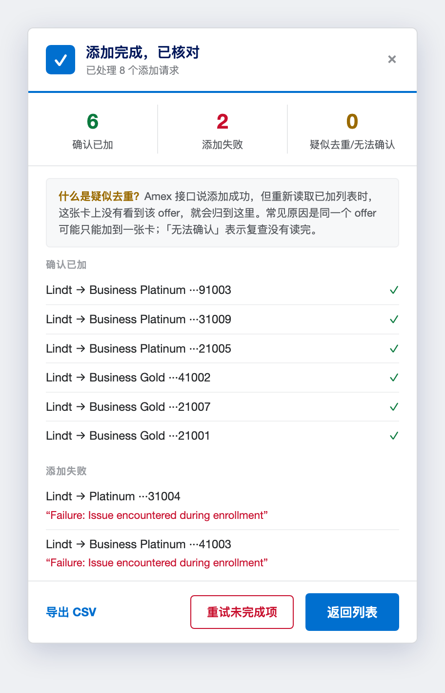
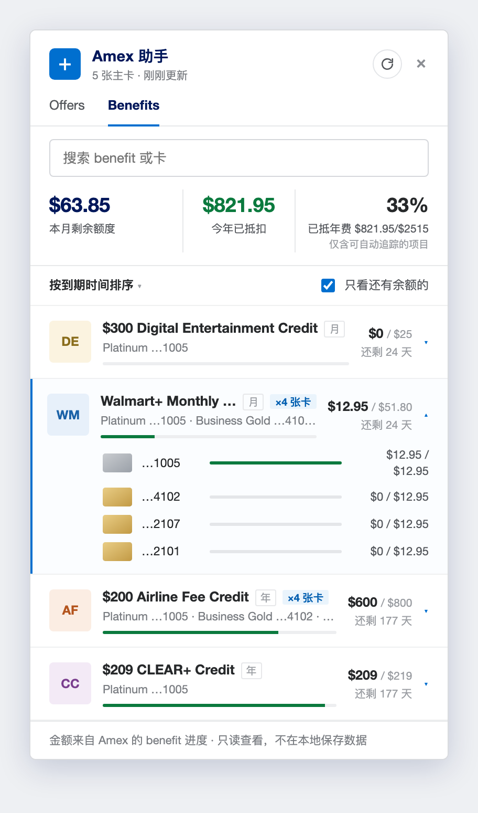

<div align="center">

# 💳 Amex Assistant

**Add one American Express Offer to all your cards — from a single panel.**

Amex only lets you add an Offer to one card at a time, and adding it to one card
often makes it vanish from the others. Amex Assistant reads every card's offers
into one panel, fires your pick at all eligible cards together, then re-reads
each card to tell you which ones **actually** got it. A second **Benefits** tab
tracks every statement credit (dining, airline fee, CLEAR…) across all your
cards — how much you've used, what's expiring, and what's left to activate.

<br>

[](https://greasyfork.org/en/scripts/585884-amex-assistant)
[](https://greasyfork.org/en/scripts/585884-amex-assistant)
[](https://github.com/olddonkey/amex-assistant/stargazers)
[](LICENSE)
[](#-privacy)
[](src/amex-assistant.user.js)

[](https://greasyfork.org/en/scripts/585884-amex-assistant)

<br>

<table align="center">
<tr valign="top">
<td width="33%"><br><sub><b>Offers</b> — pick one, add it to every eligible card</sub></td>
<td width="33%"><br><sub><b>Verify</b> — re-reads each card, reports what actually landed</sub></td>
<td width="33%"><br><sub><b>Benefits</b> — every statement credit, tracked across cards</sub></td>
</tr>
</table>

</div>

---

## ✨ Features

- **One offer → many cards.** Pick an offer once and queue it for every eligible
  card, or expand it to choose specific cards.
- **Real verification, not just "success".** After submitting, it waits for the
  server to settle, re-reads each card's added-to-card list (double-checking
  apparent misses once more), and reports what *actually* landed —
  `confirmed / failed / suspected dedupe / unconfirmed / skipped`.
- **Concurrent by design.** All cards for the *same* offer are submitted
  together — once one card takes an offer Amex can make it ineligible on the
  rest, so firing together is what lets more than one card win.
- **Retries, but never through a throttle.** Transient failures (network
  hiccups, 5xx) are re-sent quickly so a blip doesn't cost a card its window;
  on a throttle/interception signal (HTTP 429/403) the run stops early instead
  of pushing through — unsubmitted pairs are reported as `skipped` for a later
  retry.
- **Benefits dashboard.** A second tab reads every card's statement credits and
  aggregates them across cards — used vs. remaining, days left, a multi-card
  breakdown per credit, and the ones you haven't activated yet.
- **Private by construction.** `@grant none` means the script is *technically
  unable* to reach any third party — no backend, no telemetry, no IP collection.
- **Zero build.** The userscript is the whole artifact; the network layer is
  covered by a fetch-mock test suite (`node --test`) with no Amex account needed.

> ⚠️ These endpoints are undocumented; American Express may change them at any
> time. See [`DISCLAIMER.md`](DISCLAIMER.md).

## 🚀 Install

1. Install a userscript manager — [Tampermonkey](https://www.tampermonkey.net/)
   or [Violentmonkey](https://violentmonkey.github.io/).
2. Install the script:
   - **[Greasy Fork](https://greasyfork.org/en/scripts/585884-amex-assistant)**
     — one-click, recommended, **or**
   - **[direct from GitHub](https://raw.githubusercontent.com/olddonkey/amex-assistant/main/src/amex-assistant.user.js)**
     — the raw `.user.js` (installed copies auto-update from this URL).
3. Open `https://global.americanexpress.com/`, log in, and click the
   **Amex 助手** button that appears on the page.

## 📋 Use

1. Click **Amex 助手** — the panel reads every card and its offers.
2. Tick an offer to queue it for **all** its eligible cards, or expand it to
   choose specific cards. Already-added cards are disabled.
3. Click **加到所选卡**. All cards for the *same* offer are submitted together;
   different offers are paced a bit apart. When done, the panel re-reads each
   card and reports `confirmed / failed / suspected dedupe / unconfirmed /
   skipped`. If Amex throttles the session mid-run, the run stops early and the
   panel suggests waiting a few minutes before retrying the unfinished pairs.

`suspected dedupe` = Amex returned success, but the offer was **not** found on
that card after re-reading — commonly because American Express allows the same
offer on only one card. It's expected, not a tool bug (see
[`DISCLAIMER.md`](DISCLAIMER.md)).

## 🔒 Privacy

Local-only, no backend, no telemetry, no IP collection, and fully auditable
source. The header declares `@grant none`, so the script has no privileged APIs
and can only talk to `americanexpress.com` on your own logged-in session.

## 🛠️ Development

No build step. Tests and lint run on Node — no American Express account needed;
the network layer is exercised against a fetch mock in `test/`.

```sh
npm install
npm test        # node --test against fixtures + mock fetch
npm run lint    # ESLint (Google-style conventions via @stylistic)
```

### Before trusting a real run

The internal API is undocumented, so confirm it against your own live session
once (the one step that needs your login): follow the DevTools checklist in
[`docs/FINDINGS.md`](docs/FINDINGS.md) §4, then do a first real submit by
selecting a single offer on one card and confirm it shows as `confirmed`.

## 📚 Docs

| Doc | What it covers |
| --- | --- |
| [`docs/FINDINGS.md`](docs/FINDINGS.md) | The internal Amex offers API this tool uses. |
| [`docs/PLAN.md`](docs/PLAN.md) | Design, milestones, reference skeleton. |
| [`docs/IMPLEMENTATION.md`](docs/IMPLEMENTATION.md) | Agent handoff plan. |

## ⚖️ Disclaimer

Not affiliated with American Express. Automating your own account may be a gray
area of the Amex Terms of Service; use at your own risk. This tool does not, and
cannot, guarantee that an offer will be added to more than one card. MIT
licensed; written from scratch. See [`DISCLAIMER.md`](DISCLAIMER.md) and
[`LICENSE`](LICENSE).
